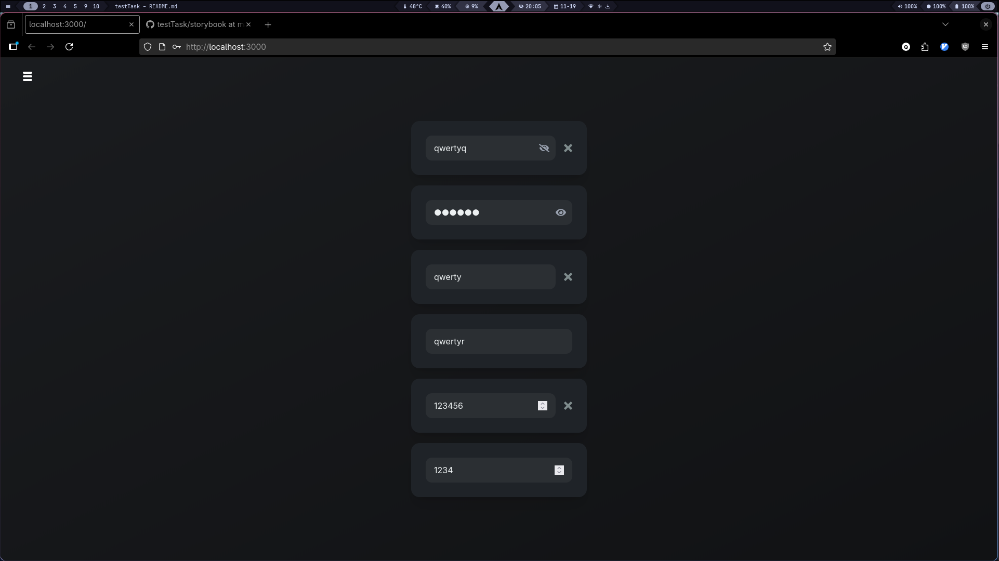
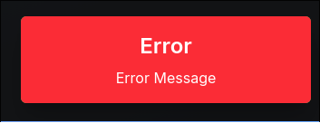
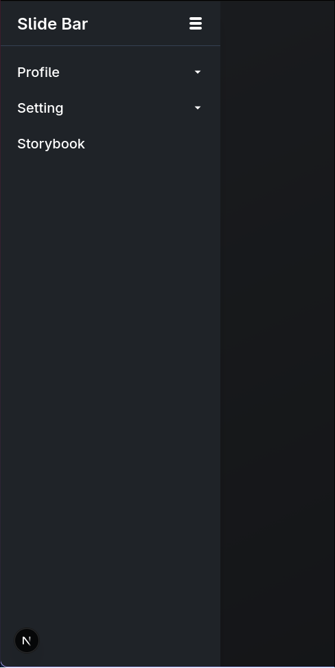
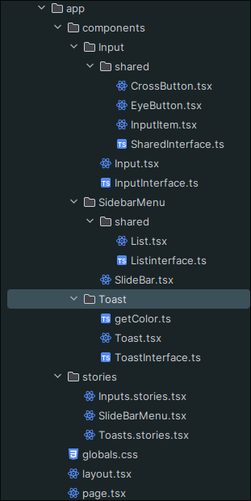
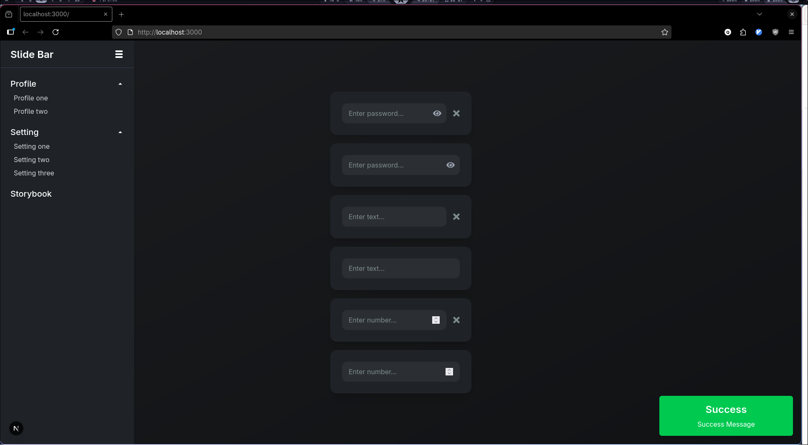

# Getting Started

```bash
git clone https://github.com/momotiukpavlo6-ship-it/testTask.git

cd storybook

npm i

npm run storybook

```

Open [http://localhost:3000](http://localhost:3000) with your browser to see the result.

## Input component

Input type="type" clearable={bolean}
    type: text, password, number
    clearable: true or false



## Toast component

Toast type="type" clearable={bolean}
type: Success, Error, Info, Warning
message: simple text
time: time in milliseconds how long toast will be visible





## SlideBarMenu component




### slide bar menu can be hidden


## interface of app



# All page


